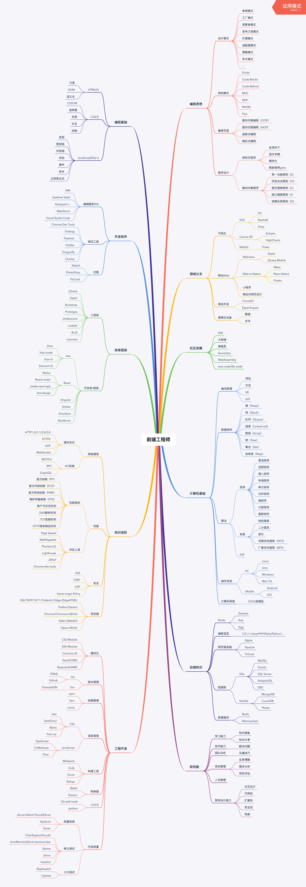

# 徐旺的职业规划
## 前言
       首先自我介绍一下，我是一名前端工程师，参与开发迄今已有四年的时间，从jq的辉煌到衰败，前端工程化一路高歌猛进，我见证了前端从一个微不足道的岗位正在蜕变成至关重要的角色，尽管我依旧平凡。
***
## 职业生涯经历

#### 2016年10月-2018年3月  
* 从php大牛手把手教我写前端到整合公司前端技术栈选型，从模版渲染过渡到使用angular 1技术栈（当时盛行）。

  后由于个人发展方向原因，离开上海来到成都寻求发展。  
#### 2018年6月-2020年11月  
* 荒度了一年半载之后在来面试前端，发生了颠覆性变化，我仅带着对angular的一知半解对工作的渺茫，边面试边学习新的技术栈，好在成功拿到一家教育机构的前端offer。  
* 18年8月，我非常荣幸加入全新的项目中，并使用全新的技术栈react进行开发，与同样爱折腾的前端战友对技术栈的不断优化。  
* 努力使人成长，通过和小伙伴们共同的努力，我们在两年中，共举办了39次前端技术分享会。

  由于公司组织架构问题，前端小伙伴们最终还是准备另谋出处，我也最终没能坚守
#### 2020年11月-？
* 在上家公司领导的引荐下最终选择了尘锋信息这个大家庭。体验了很多第一次。  
* 第一次的写作经验，写下了这篇职业规划。  
* 第一次参与To B的项目开发，理解了SaaS平台的运作。  
* 第一次的对于我来说较大失败的项目开发经历。  
* 未来可期

## 对未来的规划
### 树立目标
> 遇见最好的自己
* 深入学习前端工程师知识体系建设并建立体系建设指标markdown来监听我的学习情况

* 增强专业技术深度
#### 实施

#### 反思

> 简简单单的生活，随时保持一颗淡然的心态，友好的与人相处，与人友善，与人真诚。
